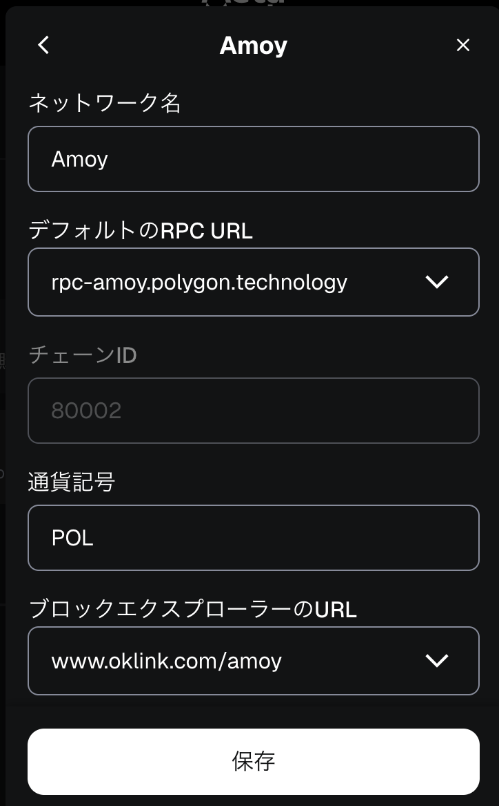

# 行なったこと
## STEP 1: ウォレットの準備
MetaMaskを、Firefoxの拡張版でインストールしました。  
そして、Polygon Testnet（Polygon Amoy Testnet）を手動でネットワークに追加しました。



「Polygon Amoy Testnet」ではなく「Amoy」が正式名かもしれません。
色々なブログサイトを見ると、トークンにMATICが使用されているのですが、POLに移行したそうなので、トークンはPOLに指定しました。
## STEP 2: テスト用トークンの入手
Polygon Testnetのfaucet（蛇口）からPOLを請求しました。  
GitHubによる認証は404エラーだったので、X.COMを用いました。


MetaMaskを確認したところ、「$0.03, 0.1 POL」となっていました。  
もっとPOLが欲しい場合は、24時間以上空けたり「Get Bulk POL Test Tokens」が必要そうです。
## STEP 3: 開発環境を整える
Dockerfileの通り、Hardhatを使用することにしました。  
コンテナに入った後、以下を実行することでインストールhardhatなどをインストールできるよにしました。
```
# ./setup.sh
```
質問には基本的にYesで回答しました。選択質問では、「Create a JavaScript project」を選びました。
## STEP 4: NFTコントラクトを書く　
BadgeNFT.solを追加しました。  
また、alchemy(https://www.alchemy.com/) に登録しておきました。  
次にhardhat.config.jsにamoy等を追記しました。  
そしてscripts/deploy.jsを作成しました。  
最後に.envファイルを作成しました。  
## STEP 5: デプロイを行う　**←今ここ**
以下のコマンドでデプロイを行いました。
```
# npx hardhat run scripts/deploy.js --network amoy
```
現状は以下のようにうまくいっていないです。
```
  reason: 'insufficient funds for intrinsic transaction cost',
  code: 'INSUFFICIENT_FUNDS',
  error: ProviderError: INTERNAL_ERROR: insufficient funds
  ...
```
資金不足が原因なら、断念するしかなさそう、という感じです...。
### 必要資金の見積もり
以下によると、0.15 POL必要そうです。
```
# npx hardhat console --network amoy
> const factory = await ethers.getContractFactory("BadgeNFT");
undefined
> 
> // コンストラクタの引数を渡す
undefined
> const deployTx = factory.getDeployTransaction("MyBadgeNFT", "MBN");
undefined
> 
> // デプロイに必要なガスを推定
undefined
> const gasEstimate = await factory.signer.estimateGas(deployTx);
undefined
> 
> // ガス価格を取得
undefined
> const gasPrice = await ethers.provider.getGasPrice();
undefined
> 
> // 出力
undefined
> console.log("Estimated gas:", gasEstimate.toString());
Estimated gas: 1971656
undefined
> console.log("Gas price:", gasPrice.toString());
Gas price: 76767567149
undefined
> console.log("Total needed (wei):", gasEstimate.mul(gasPrice).toString());
Total needed (wei): 151359234374728744
undefined
> console.log("Total needed (POL):", ethers.utils.formatEther(gasEstimate.mul(gasPrice)));
Total needed (POL): 0.151359234374728744
```
## STEP 6: メタデータ（証明情報）を用意
STEP5完了待ち
## STEP 7: 発行テスト
STEP5完了待ち

# ファイルの追加・書き換えについて
## BadgeNFT.sol
blockchain/contractsに以下のBadgeNFT.solを追加しました。
```
// SPDX-License-Identifier: MIT
pragma solidity ^0.8.20;

import "@openzeppelin/contracts/token/ERC721/ERC721.sol";
import "@openzeppelin/contracts/access/Ownable.sol";

contract BadgeNFT is ERC721, Ownable {
    uint256 private _nextTokenId = 1;

    constructor() ERC721("Learning Badge", "LBADGE") Ownable(msg.sender) {}

    function mint(address to) public onlyOwner {
        _safeMint(to, _nextTokenId);
        _nextTokenId++;
    }
}
```
## hardhat.config.js
以下を作成しました。
```
require("@nomicfoundation/hardhat-toolbox");
require("dotenv").config();

const { ALCHEMY_API_KEY, PRIVATE_KEY } = process.env;

/** @type import('hardhat/config').HardhatUserConfig */
module.exports = {
  solidity: "0.8.20",
  networks: {
    amoy: {
      url: `https://polygon-amoy.g.alchemy.com/v2/${ALCHEMY_API_KEY}`, // Alchemyの場合
      accounts: PRIVATE_KEY ? [PRIVATE_KEY] : [],
    },
    localhost: {
      url: "http://127.0.0.1:8545",
    },
  },
};
```
## deploy.js
scripts配下に以下を作成しました。
```
const hre = require("hardhat");

async function main() {
  // デプロイするコントラクトのFactoryを取得
  const BadgeNFT = await hre.ethers.getContractFactory("BadgeNFT");

  // デプロイ実行
  const badgeNFT = await BadgeNFT.deploy();

  // デプロイ完了まで待機
  await badgeNFT.deployed();

  console.log("BadgeNFT deployed to:", badgeNFT.address);
}

// エラーハンドリング付き実行
main().catch((error) => {
  console.error(error);
  process.exitCode = 1;
});
```
## .env
.gitignoreに含まれているので、各自MetaMaskとalchemyのアカウントを作成する必要があります。(以下のXXXXXは人によって異なります。)
```
AMOY_RPC_URL=XXXXX
AMOY_PRIVATE_KEY=XXXXX
```